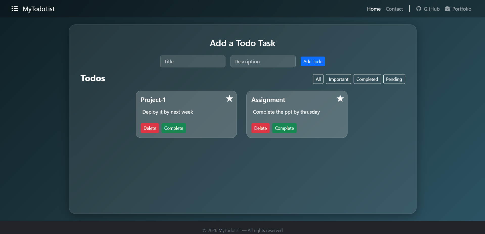

# 📝 Todo List Application

A **React-based Todo List application** that allows users to create, organize, and manage daily tasks efficiently.  
The application uses **React Hooks, LocalStorage persistence, filtering, and a responsive Bootstrap UI**.

---

# 🌐 Live Demo

Deployed Application:  
https://todolistapp-67a4.onrender.com

---

# 📸 Application UI

Screenshots of the application UI are stored inside the **assets folder**.

Example:



You can add more screenshots if needed:


---

# 📌 Features

## Task Management

- Add new tasks
- Delete existing tasks
- Mark tasks as **completed**
- Mark tasks as **important**
- Completed tasks automatically **remove the important flag**

## Filtering System

Users can filter tasks using:

- **All** – shows every task
- **Important** – shows starred tasks
- **Completed** – shows finished tasks
- **Pending** – shows unfinished tasks

## Persistent Storage

- Todos are stored in **browser LocalStorage**
- Tasks remain available after page refresh

## UI / UX

- Responsive **Bootstrap layout**
- Card-based task display
- Visual indicators for:
  - Important tasks ⭐
  - Completed tasks ✓
- Active filter highlighting
- Scrollable task container

## Routing

Implemented using **React Router**

Pages:

- **Home** – Todo manager
- **Contact** – simple contact page

## Component-Based Architecture

The application follows modular React component design.

---

# 🛠 Tech Stack

**Frontend**

- React (Create React App)

**State Management**

- React Hooks (`useState`, `useEffect`)

**Routing**

- React Router

**Storage**

- Browser LocalStorage

**Styling**

- Bootstrap
- Custom CSS

**Testing**

- Jest
- React Testing Library

**Deployment**

- Render

---

# 📂 Project Structure

```
TODO-LIST/
│
├── assets/
│   └── ui-preview.png
│
├── public/
│
├── src/
│   ├── components/
│   │   ├── Contact.js
│   │   ├── ContactMe.js
│   │   ├── Footer.js
│   │   ├── Header.js
│   │   ├── todoAdd.js
│   │   ├── TodoDisplay.js
│   │   └── Todos.js
│   │
│   ├── App.js
│   ├── App.css
│   ├── index.js
│   ├── index.css
│   ├── App.test.js
│   ├── reportWebVitals.js
│   └── setupTests.js
│
├── .gitignore
├── package.json
└── package-lock.json
```

---

# 🚀 Installation & Setup

## 1 Clone the Repository

```
git clone https://github.com/your-username/TODO-LIST.git
```

## 2 Navigate to the Project Directory

```
cd TODO-LIST
```

## 3 Install Dependencies

```
npm install
```

## 4 Start Development Server

```
npm start
```

Application runs at:

```
http://localhost:3000
```

---

# 📖 Application Workflow

1. User enters a task using the input form.
2. Task is stored in **React state**.
3. The state synchronizes with **LocalStorage**.
4. Tasks are displayed as **cards**.
5. Users can:
   - mark tasks important
   - mark tasks completed
   - delete tasks
6. Users can filter tasks using the **navigation filter bar**.
7. On page refresh, tasks are restored from **LocalStorage**.

---

# 🧪 Running Tests

```
npm test
```

---

# 📈 Future Improvements

- Drag and drop task ordering
- Due dates for tasks
- Dark / light theme toggle
- Task editing feature
- Backend integration for multi-device sync

---

# 📄 License

This project is developed for **educational and portfolio purposes**.
