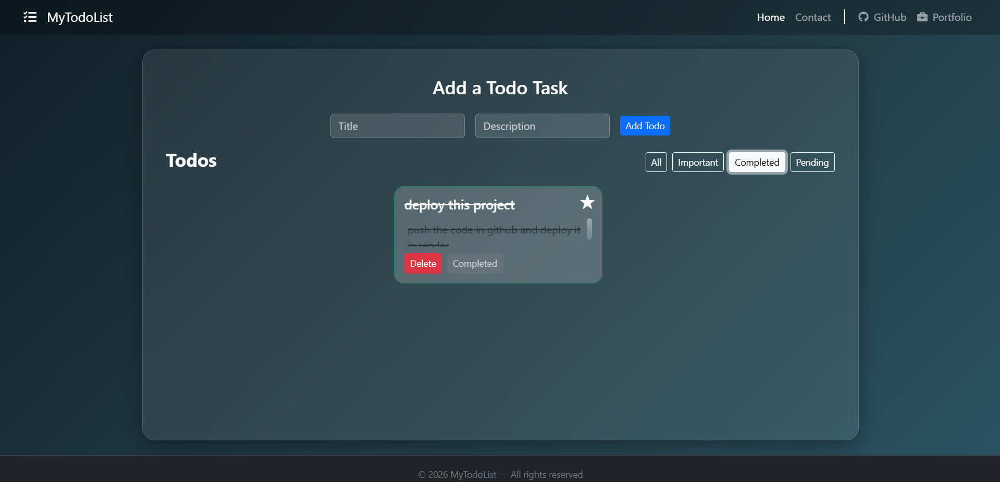
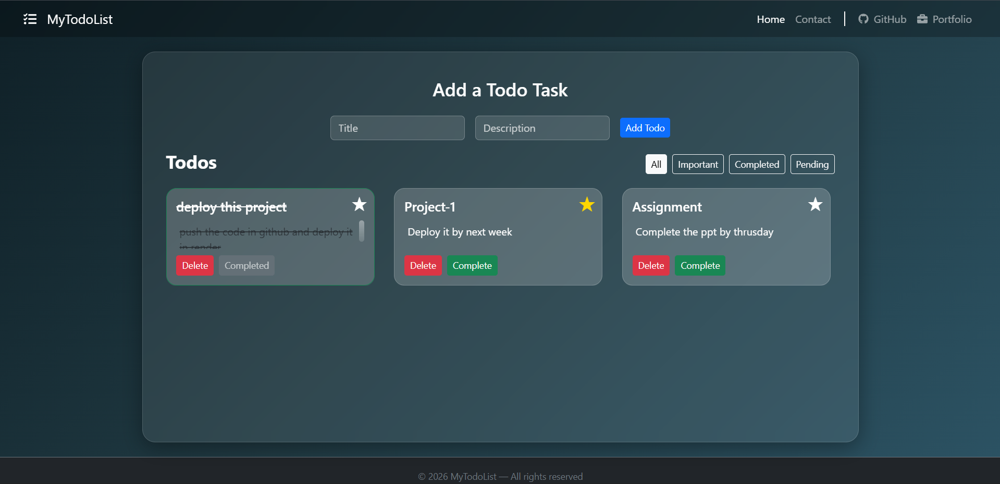
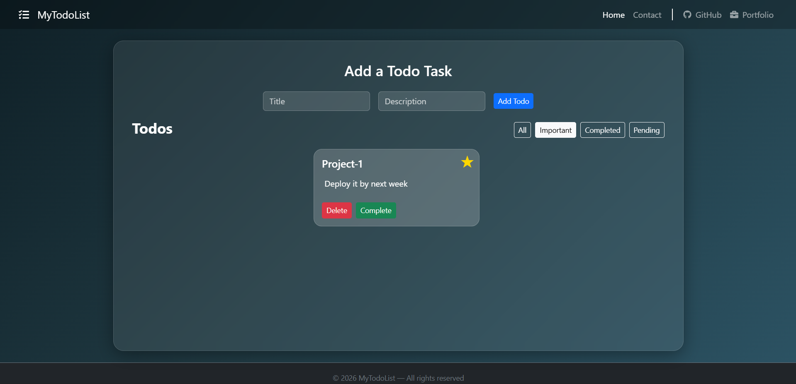

# 📝 Todo List Application


A **React-based Todo List application** that allows users to create, organize, and manage daily tasks efficiently.  
The application uses **React Hooks, LocalStorage persistence, filtering, and a responsive Bootstrap UI** to provide a clean and intuitive task management experience.

---

# 🌐 Live Demo

Deployed Application:  
https://todolistapp-67a4.onrender.com

---

# 📸 Application UI

<p align="center">
  
</p>

<p align="center">
  
</p>

<p align="center">
  
</p>

<p align="center">
  
</p>
---

# 📌 Features

## Task Management

- Add new tasks
- Delete tasks
- Mark tasks as **completed**
- Mark tasks as **important**
- Completed tasks automatically **remove the important flag**
- Tasks update instantly using React state

---

## Filtering System

Users can filter tasks using:

- **All** – shows every task
- **Important** – shows starred tasks
- **Completed** – shows finished tasks
- **Pending** – shows unfinished tasks

Active filters are visually highlighted for clarity.

---

## Task Counter

The application dynamically displays the number of visible tasks based on the selected filter.

Example:

```
Todos   Showing 3 of 3
```

This indicator updates automatically when:

- tasks are added
- tasks are completed
- tasks are deleted
- filters are applied

---

## Persistent Storage

- Todos are stored using **browser LocalStorage**
- Tasks remain saved even after page refresh
- State automatically synchronizes with LocalStorage

---

## UI / UX

- Responsive **Bootstrap layout**
- Modern **card-based task interface**
- Visual indicators for:
  - ⭐ Important tasks
  - ✓ Completed tasks
- Active filter highlighting
- Scrollable task container
- Minimal and clean productivity-style UI

---

## Routing

Implemented using **React Router**.

Pages included:

- **Home** – Main todo manager
- **Contact** – Simple contact page

---

## Component-Based Architecture

The application follows a modular React structure:

- Reusable components
- Clear separation of concerns
- Simple state flow using React hooks

Main components include:

- Header
- TodoAdd
- TodoDisplay
- Todos
- Footer
- Contact

---

# 🛠 Tech Stack

### Frontend

- React (Create React App)

### State Management

- React Hooks (`useState`, `useEffect`)

### Routing

- React Router

### Storage

- Browser LocalStorage

### Styling

- Bootstrap
- Custom CSS

### Testing

- Jest
- React Testing Library

### Deployment

- Render

---

# 📂 Project Structure

```
TODO-LIST/
│
├── public/
│   ├── ui-preview.png
│   ├── Completed-view.png
│   ├── Pending-view.png
│   └── Important-view.png
│
├── src/
│   ├── components/
│   │   ├── Contact.js
│   │   ├── ContactMe.js
│   │   ├── Footer.js
│   │   ├── Header.js
│   │   ├── todoAdd.js
│   │   ├── TodoDisplay.js
│   │   └── Todos.js
│   │
│   ├── App.js
│   ├── App.css
│   ├── index.js
│   ├── index.css
│   ├── App.test.js
│   ├── reportWebVitals.js
│   └── setupTests.js
│
├── .gitignore
├── package.json
└── package-lock.json
```

---

# 🚀 Installation & Setup

### 1 Clone the Repository

```
git clone https://github.com/your-username/TODO-LIST.git
```

### 2 Navigate to the Project Directory

```
cd TODO-LIST
```

### 3 Install Dependencies

```
npm install
```

### 4 Start Development Server

```
npm start
```

Application runs at:

```
http://localhost:3000
```

---

# 📖 Application Workflow

1. User enters a task in the input form.
2. Task is stored in **React state**.
3. The state synchronizes with **LocalStorage**.
4. Tasks appear as **cards** in the interface.
5. Users can:
   - mark tasks important
   - mark tasks completed
   - delete tasks
6. Users can filter tasks using the **navigation filter bar**.
7. The **task counter updates automatically**.
8. Tasks remain saved even after refreshing the page.

---

# 🧪 Running Tests

```
npm test
```

---

# 📈 Future Improvements

- Drag and drop task ordering
- Due date support
- Dark / light theme toggle
- Task editing feature
- Backend integration for multi-device synchronization

---

# 📄 License

This project is developed for **educational and portfolio purposes**.
